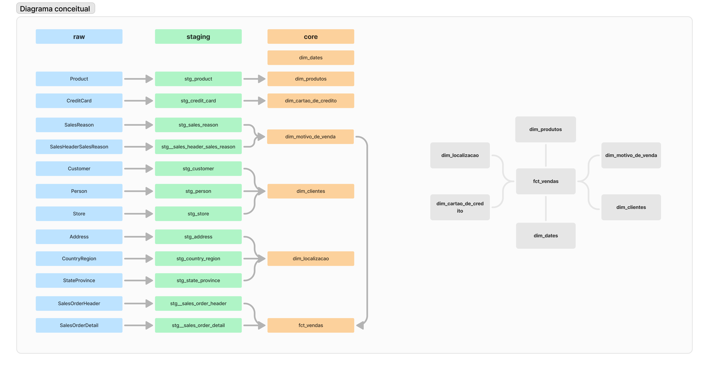

# Projeto de Análise de Dados da Adventure Works

## Estrutura do Projeto
O projeto está dividido nas seguintes etapas principais:
1. **Configuração do Data Warehouse**
2. **Transformação dos Dados**
3. **Modelagem das Tabelas de Dimensão e Fato**
4. **Desenvolvimento de Dashboards de BI**

## Ferramentas Utilizadas
- **dbt (data build tool)**: Utilizado para gerenciar o processo de transformação dos dados.
- **Snowflake**: Armazenamento e processamento dos dados.
- **Power BI**: Criação de dashboards interativos para visualização dos dados.

## Processos de Transformação e Tratamento de Dados
1. **Configuração do Data Warehouse**: O Data Warehouse foi configurado na nuvem utilizando o Snowflake, e o dbt foi integrado para facilitar o gerenciamento do processo de transformação.
2. **Transformação dos Dados**: Os dados brutos foram transformados utilizando o dbt, incluindo:
   - Documentação das tabelas e colunas.
   - Testes de sources e chaves primárias.
   - Testes de dados para garantir a integridade e a precisão.
3. **Modelagem das Tabelas de Dimensão e Fato**: Foram criados modelos para tabelas de dimensão (clientes, produtos, datas, localização, motivo de venda, cartão de crédito) e tabela de fato (Vendas).

## Análises Realizadas
- **Desempenho de Vendas**: Número de pedidos, quantidade comprada e valor total negociado por produto, tipo de cartão, motivo de venda, data de venda, cliente, status, cidade, estado e país
- **Análise de Ticket Médio**: Produtos com maior ticket médio por mês, ano e região.
- **Top Clientes**: Identificação dos 10 melhores clientes por valor total negociado.
- **Melhores Cidades**: Análise das 5 melhores cidades em valor total negociado.
- **Tendências sazonal**: Volume de pedidos e quantidade comprada por mêse anos.
- **Promoções**: Produtos com maior quantidade de unidades compradas para o motivo de venda "Promotion".

## Diagrama conceitual do data warehouse

